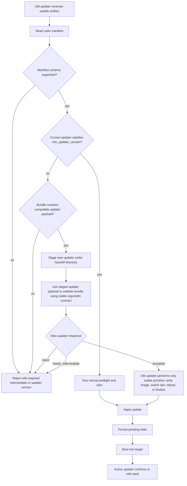

# Helios Updater Architecture

`helios-updater` is the device-local update engine for HeliOS.

It is not intended to be a second control plane beside Orion.
Remote update orchestration should happen through Orion workloads. Local tooling such as
`heliosctl` may invoke the updater directly for recovery or lab workflows, but both paths must
hit the same updater engine and state machine.

## Scope

The updater owns:

- update preflight and compatibility checks
- manifest parsing and validation
- A/B rootfs slot planning for OS images
- staging and activation of service payload updates
- boot switch planning and rollback tracking
- migration hook planning and execution ordering
- publishing updater runtime state back into Orion

The updater does not own:

- fleet-wide rollout policy outside Orion
- cluster scheduling semantics
- ad hoc service replacement logic that bypasses the update engine

## Invocation Model

There is one updater engine with two invocation surfaces:

1. Orion workloads
   - canonical remote orchestration path
   - cluster schedules a `helios.system.update.v1` workload to a node
2. Local CLI
   - operational escape hatch through `heliosctl`
   - should call into the same updater engine and state machine

## Artifact Classes

The updater supports two artifact classes:

1. `os-image`
   - full HeliOS rootfs/system update
   - always A/B
   - rollback is automatic by default
2. `payload-update`
   - service/bin/workload/plugin payloads
   - staged into managed release locations

## A/B Rules

For `os-image` updates, these rules are invariants:

- updates target the inactive slot
- the inactive slot may be created or resized as part of install
- if more room is needed for the inactive slot, DATA is the partition that must shrink
- DATA expansion is not permanent ownership of the tail of the disk; updater may reclaim that space for A/B capacity
- the boot target only changes after staging succeeds
- boot success must be marked explicitly after post-boot health passes
- failure to mark success causes rollback to the previous slot

### Data Partition Rule

The updater must treat the DATA partition as elastic.

That means:

- first-boot provisioning may expand DATA to fill the remaining device space
- later OS updates are allowed to shrink DATA again if the inactive slot needs to be created or enlarged
- updater is responsible for coordinating that resize through the same storage layout contract used by `helios-provision`
- slot resize is not a separate provisioning system; it is part of the same update lifecycle

The planner may decide that an update requires:

- no repartitioning
- inactive slot creation
- inactive slot growth by reclaiming space from DATA

The executor must only proceed to image apply after the required storage layout exists.

Current implementation:

- when the planner returns `CreateInactive` or `ResizeInactive`, updater now writes:
  - `repartition-request.env`
  - `repartition-layout.toml`
  into the OTA request area consumed by Gaia provisioning
- the request currently reuses the system storage layout manifest instead of inventing a second repartition schema
- updater persists repartition request state so it can distinguish:
  - request issued and awaiting reboot
  - Gaia completed repartition
  - repartition returned a terminal failure status
- updater validates the storage layout manifest before issuing the request:
  - live repartition must explicitly allow destructive DATA borrow
  - the manifest must declare both `slot_b` and `data`
  - `slot_b` must have a concrete projected size contract:
    - fixed `size_mib`, or
    - `size_source = "mirror_existing"`
  - updater now proves that projected `slot_b` capacity is at least as large as the requested inactive-slot minimum before rebooting for repartition
- updater then requests an immediate reboot so `helios-provision-squashfs.sh` can perform the storage mutation on the next boot path

## Boot Partition Handling

The updater treats BOOT as coordination-critical state, not just a passive partition.

The supported slot scheme today is:

1. `squashfs_ab`
   - boot uses the squashfs initramfs selector path
   - initramfs chooses `ROOT_A` vs `ROOT_B` using the OTA slot markers
   - updater must write the slot markers in the exact locations Gaia/initramfs already consume

Current rule:

- updater may write OTA coordination files under:
  - `/boot/helios/ota`
  - `/var/lib/helios/ota`
- updater may also install manifest-declared BOOT assets into `/boot` as part of an `os-image` update
- if BOOT assets are declared, `/boot` must be mounted and writable before the update can proceed
- updater now requests a reboot after successful OS-image preparation so the boot handoff can actually occur
- updater now also writes explicit boot-confirm request metadata, and Gaia OTA confirm writes explicit confirmation results back into the same OTA area

Future rule:

- if an update requires new firmware, kernel, initramfs, or boot config assets, those must be first-class manifest payloads and part of the same update transaction
- boot partition changes must not be hidden side effects

## Artifact And Bundle Contract

There is one logical update manifest model, even if transport formats evolve.

Current artifact classes:

1. `os-image`
   - full rootfs payload
   - must declare A/B requirements
   - may declare minimum inactive slot size

2. `payload-update`
   - managed service or workload payloads
   - declares one or more named targets and revisions

### Current Metadata Shape

Today the updater resolves manifests from Orion artifact metadata labels.

Implemented common fields:

- `helios.update.class`
- `helios.update.version`
- `helios.update.manifest_version`
- `helios.update.board`
- `helios.update.min_updater_version`
- `helios.update.requires_ab_rootfs`

Implemented `os-image` fields:

- `helios.update.image_url`
- `helios.update.size_bytes`
- `helios.update.sha256`
- `helios.update.inactive_slot_min_bytes`
- `helios.update.boot.<n>.path`
- `helios.update.boot.<n>.source`
- `helios.update.boot.<n>.size_bytes`
- `helios.update.boot.<n>.sha256`

Implemented `payload-update` fields:

- `helios.update.target.<n>.name`
- `helios.update.target.<n>.revision`
- `helios.update.target.<n>.artifact_path`

Implemented hook fields:

- `helios.update.hook.<n>.phase`
- `helios.update.hook.<n>.command`

Hook commands are currently encoded as JSON argv arrays, for example:

- `helios.update.hook.0.phase=postboot`
- `helios.update.hook.0.command=["/usr/bin/helios-migrate","finalize"]`

### Accepted Payload Formats

Current accepted `os-image` sources:

- `file://...`
- `http://...`
- `https://...`

Current accepted `os-image` payload file formats:

- raw image payloads such as `.img`
- raw binary payloads such as `.bin`
- xz-compressed images such as `.img.xz`

Current accepted BOOT asset sources:

- `file://...`
- `http://...`
- `https://...`
- local filesystem path

Current BOOT asset rules:

- BOOT asset paths are relative to `/boot`
- updater rejects absolute paths and parent-directory traversal
- BOOT assets are staged and validated before apply
- updater installs BOOT assets into `/boot` after writing the inactive slot image and before switching OTA markers

Current accepted `payload-update` sources:

- local filesystem path
- `file://...`
- `http://...`
- `https://...`

### Long-Term Bundle Direction

The label-driven manifest model is sufficient for bring-up, but it is not the intended final contract.

The target architecture is:

- one explicit manifest document
- one uploaded update bundle or artifact payload
- bundle contains:
  - manifest
  - payloads
  - checksums/signatures
  - optional hooks

In that model, Orion artifacts should reference the bundle payload, not force all manifest semantics into labels.

## Updater Compatibility Contract

Updater compatibility must fail early and explain the required bridge release before any disk mutation.

The compatibility manifest must live inside the update image or bundle, not in DATA-backed state.
An old rootfs evaluating a new rootfs cannot trust `/var/lib/helios` because that path resolves to
the currently mounted DATA area, not the target image contents.

Stable manifest locations, checked in order after the target rootfs or bundle is mounted:

- `/etc/helios/update-manifest.json`
- `/usr/share/helios/update/manifest.json`
- `/manifest.json`

The old updater may still use its own DATA-backed state and staging directories for local bookkeeping,
but compatibility decisions must come from the target image or the update bundle. OTA boot markers
remain in the Gaia/initramfs coordination area only after compatibility and preflight pass.

### Manifest Compatibility Fields

The manifest needs enough compatibility metadata for an old updater to reject safely:

- `helios.update.manifest_version`
- `helios.update.version`
- `helios.update.min_updater_version`
- `helios.update.max_source_version`
- `helios.update.requires_intermediate_version`
- `helios.update.handoff_protocol`
- `helios.update.handoff_min_protocol`
- `helios.update.updater_payload.path`
- `helios.update.updater_payload.sha256`

`min_updater_version` is the hard floor for parsing and planning the update. `requires_intermediate_version`
is the explicit "install X before Y" escape hatch when no stable handoff can cover the gap.

### Handoff Flow



Stable compatibility command for updater payloads:

```text
helios-updater validate-update --request-json -
```

The request must include the current updater version, current system version, target manifest,
staged bundle path, and the exact stable primitives the old updater can execute. The response must
be one of:

- `reject`
  - update cannot be applied from this source
- `needs_intermediate`
  - user must install the declared intermediate version first
- `accepted`
  - the old updater may continue with the stable primitives it already knows

The old updater must not execute unknown instructions returned by a newer updater. It can only do
operations already covered by its stable ABI: persist state, switch boot target, request reboot,
finalize success, or request rollback.

## Hook Model

Artifacts may declare versioned hooks:

- `preinstall`
- `preswitch`
- `postboot`
- `rollback_cleanup`

Hooks must be explicit in the manifest. Hidden image behavior is not acceptable.

Current behavior:

- `os-image`
  - `preinstall` runs before image write
  - `preswitch` runs after image apply and before boot handoff is persisted
  - updater writes pending OTA markers and requests reboot after the inactive slot is prepared
  - updater writes a confirm request so Gaia can acknowledge successful boot confirmation explicitly
  - `postboot` runs after Gaia confirmation is observed or the boot handoff is otherwise proven complete
  - if the new slot does not confirm within the configured timeout, updater requests rollback and reboots back toward the previous slot
  - `rollback_cleanup` runs after a rollback outcome is observed

- `payload-update`
  - `preinstall` runs before activation
  - `preswitch` runs before service cutover
  - target binaries are activated through the managed release tree
  - services are restarted when systemd is available
  - `postboot` runs immediately after successful activation
  - on activation or postboot failure, previously activated targets are rolled back and `rollback_cleanup` runs

Hook execution contract:

- each hook may declare:
  - `helios.update.hook.<n>.timeout_secs`
- if omitted, updater uses its configured default timeout
- updater provides a stable environment to every hook:
  - `HELIOS_UPDATE_WORKLOAD_ID`
  - `HELIOS_UPDATE_ARTIFACT_ID`
  - `HELIOS_UPDATE_VERSION`
  - `HELIOS_UPDATE_CLASS`
  - `HELIOS_UPDATE_PHASE`
- updater captures hook stdout/stderr under:
  - `/var/lib/helios/updater/hooks/<workload-id>/`
- hook failures now report the persisted stdout/stderr paths so failures are diagnosable after the fact

## Runtime Shape

The crate is organized around:

- `config`
  - environment and filesystem layout
- `manifest`
  - declared artifact schema and hooks
- `model`
  - updater domain types and state
- `engine`
  - state machine and execution planning
- `service`
  - runtime façade used by Orion/local frontends
- `releases`
  - payload/service staging helpers

Related Helios bins:

- `src/helios/ctl`
  - thin local control surface over the updater engine
- `src/helios/provision`
  - storage/layout provisioning helper reused by first-boot and future slot resize flows

## Current Implementation Status

This crate is still early.

What exists now:

- explicit update manifest types
- explicit updater state machine types
- A/B slot-aware planning rules
- real slot probing from Gaia layout state
- artifact staging for OS images and payload updates
- initial executor path for:
  - staging service payloads
  - writing OS images to the inactive slot
  - installing manifest-declared BOOT assets into `/boot`
  - writing slot/OTA pending markers
- reboot request after OS-image prepare
- repartition request handoff into Gaia OTA/provisioning for missing or undersized inactive slots
- persisted repartition request/result observation so requests are not blindly reissued on every loop
- capacity-aware repartition validation so updater only reboots when the declared layout can actually satisfy the requested inactive-slot size
- persisted prepared-state observation across boots
- explicit boot-confirm handshake:
  - updater writes `confirm-request.env`
  - Gaia OTA confirm writes `confirm-result.env`
- timeout-driven rollback request for unconfirmed OS-image boots
- immediate completion path for payload updates with managed-bin rollback on activation failure
- manifest-declared hook parsing and execution
- per-hook timeout support
- persisted hook stdout/stderr logs and stable hook execution environment

What still needs implementation:

- richer hook contract for declared inputs, environment, and logging
- richer bundle format beyond label-only manifests
